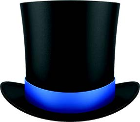
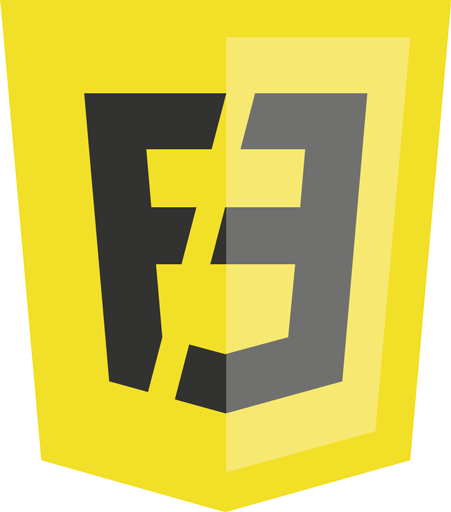

###### WEEK 02

## Library DAY

둘째 주, jQuery 외 몇몇 라이브러리 활용 방법에 대해 이야기 나눠 봅니다.

### 0. ES6 + jQuery 개발을 위한 설정

1. [yarn](https://yarnpkg.com) 개발 모듈 관리
1. [npx](https://github.com/zkat/npx) NPM 패키지 바이너리 실행
1. [bayside](https://www.npmjs.com/package/bayside) Node 프레임워크
1. [babel](https://babeljs.io/) JavaScript 컴파일러
1. [eslint](https://eslint.org/) Code Linting 유틸리티
1. [rollup](https://rollupjs.org/) 모듈 번들러

---

### 1. jQuery Library

설명이 필요없는 유명한 DOM 컨트롤 라이브러리. 
2006년 등장 이후, 11년 째 프론트엔드 세계의 초 인기 라이브러리. (과연? 언제까지?!)

- [jQuery](http://jquery.com/)
- [jQuery API](http://api.jquery.com/)
- [Learn jQuery](http://learn.jquery.com/)
- [try jQuery](http://try.jquery.com/)

---

### 2-1. VelocityJS Library

성능 좋은 JavaScript 애니메이션 라이브러리.

VelocityJS는 jQuery `.animate()`와 동일한 API를 제공하는 애니메이션 엔진으로 jQuery 없이도 작동합니다. `.animate()`와 달리, 매우 빠르고 컬러(Color), 트랜스폼(Transform), 반복(Loop), 이징(easings), 스크롤(Scroll), SVG 애니메이션 등 다양한 기능을 지원합니다.

WhatsApp, Tumblr, Windows, Samsung, Uber 등 수많은 회사가 VelocityJS를 사용하고 있습니다. [Libscore.com](http://libscore.com/)을 방문하면 어떤 사이트가 VelocityJS를 웹서비스에 사용하는지 확인할 수 있습니다.

- [velocityjs.org](http://velocityjs.org/)
- [velocityjs GitHub](https://github.com/julianshapiro/velocity)
- [VelocityJS 사용법](./VelocityJS/VelocityJS.md)

---

### 2-2. GreenSock Library

GreenSock 애니메이션 플랫폼(GSAP) 라이브러리.

> jQuery 애니메이션 기능이 있는데? GSAP를 사용해야 하는 이유? 
> jQuery 보다 GSAP 애니메이션이 무려 20배 가량 빠르기 때문<i>!</i>

- [GSAP](https://greensock.com)
- [GSAP Documentation](https://greensock.com/docs/#/HTML5/GSAP)[°](Documents/GSAP.md)
- [HTML5 Animation Speed TEST](https://greensock.com/js/speed.html)
- [GSAP vs jQuery](https://greensock.com/jquery/)
- [jQuery GSAP Plugin](https://greensock.com/jquery-gsap-plugin)
- [GSAP 사용법](./GSAP/GSAP.md)

---

### 3. Scroll Magic Library

마법 같은 스크롤 인터랙션 자바스크립트 라이브러리.

- [ScrollMagic](http://scrollmagic.io)
- [ScrollMagic Documentation](http://scrollmagic.io/docs/)
- [ScrollMagic 사용법](./ScrollMagic/ScrollMagic.md)

<!-- --- -->

<!-- ### 4. Front-End Develop

- [Front-End Roadmap](https://github.com/kamranahmedse/developer-roadmap#-front-end-roadmap)
- [Front-End HandBook 2017](https://frontendmasters.com/books/front-end-handbook/2017/)
- [stateofjs](http://stateofjs.com/)
- [frontend tooling survey 2016 results](https://ashleynolan.co.uk/blog/frontend-tooling-survey-2016-results)
- [getting started with webpack 2](https://blog.madewithenvy.com/getting-started-with-webpack-2-ed2b86c68783)
- [이제와서 jQuery를 쓰면 안되는 이유](https://www.tokyobranch.net/archives/6598) -->