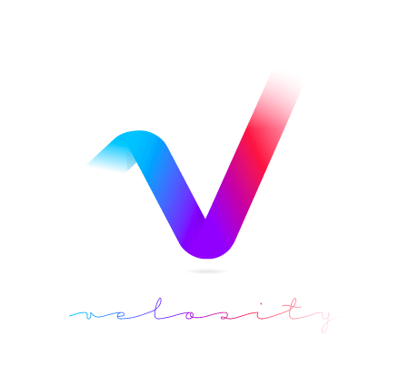

###### JavaScript Library
# VelocityJS

> 목차를 펼쳐 보려면 아래  `► 목차`를 클릭하세요.

<details>
  <summary>목차</summary>

  <br>

  - [퀵 스타트<i>!</i>](#퀵-스타트ii)
    - [VelocityJS를 사용해야 하는 이유](#velocityjs를-사용해야-하는-이유)
    - [1. 파일 다운로드 및 CDN 로드](#1-파일-다운로드-및-cdn-로드)
    - [2. 기본 사용법](#2-기본-사용법)
      - [2-1. jQuery와 VelocityJS 사용하기](#2-1-jquery와-velocityjs-사용하기)
        - [jQuery, VelocityJS 애니메이션 설정 코드는 매우 유사](#jquery-velocityjs-애니메이션-설정-코드는-매우-유사)
      - [2-2. jQuery 없이 VelocityJS 사용하기](#2-2-jquery-없이-velocityjs-사용하기)
    - [3. jQuery VS VelocityJS 코드 비교](#3-jquery-vs-velocityjs-코드-비교)
      - [3-1. CSS 속성 애니메이션](#3-1-css-속성-애니메이션)
      - [3-2. VelocityJS로 slide, Fade 사용하기](#3-2-velocityjs로-slide-fade-사용하기)
      - [3-3. VelocityJS로 slideToggle 구현하기](#3-3-velocityjs로-slidetoggle-구현하기)
    - [4. VelocityJS 오리지널 기능](#4-velocityjs-오리지널-기능)
      - [4-1. VelocityJS 스크롤 애니메이션](#4-1-velocityjs-스크롤-애니메이션)
      - [4-2. VelocityJS 리버스(reverse) 애니메이션](#4-2-velocityjs-리버스reverse-애니메이션)
    - [5. UI Pack](#5-ui-pack)
      - [5-1. 파일 다운로드 및 CDN 로드](#5-1-파일-다운로드-및-cdn-로드)
      - [5-2. stagger 옵션을 사용한 순차 애니메이션](#5-2-stagger-옵션을-사용한-순차-애니메이션)
    - [6. 애니메이션 시퀀스](#6-애니메이션-시퀀스)

  - [레퍼런스](#레퍼런스)
    - [기본](#기본)
      - [기본: 전달인자](#기본-전달인자)
        - [기본: 옵션 재정의 - 기본 옵션](#기본-옵션-재정의---기본-옵션)
        - [기본: 전달인자 - 1개의 객체 설정](#기본-전달인자---1개의-객체-설정)
      - [기본: 속성맵](#기본-속성맵)
        - [기본: 단위](#기본-단위)
      - [기본: 체이닝](#기본-체이닝)
    - [옵션](#옵션)
      - [옵션: 지속시간(duration)](#옵션-지속시간duration)
        - [시간 별칭](#시간-별칭)
      - [옵션: 이징(Easing)](#옵션-이징easing)
        - [옵션: 속성 별 개별 이징](#옵션-속성-별-개별-이징)
      - [옵션: 사용자 정의 이징(고급)](#옵션-사용자-정의-이징고급)
      - [옵션: 대기열(큐, queue)](#옵션-대기열큐-queue)
        - [병렬(parallals) 애니메이션](#병렬parallals-애니메이션)
      - [옵션: 시작/진행/종료 콜백 함수](#옵션-시작진행종료-콜백-함수)
        - [시작(Begin)](#시작begin)
        - [종료(Complete)](#종료complete)
        - [진행(Progress)](#진행progress)
      - [옵션: 모바일 하드웨어 가속](#옵션-모바일-하드웨어-가속)
      - [옵션: 루프(Loop)](#옵션-루프loop)
      - [옵션: 지연시간(delay)](#옵션-지연시간delay)
      - [옵션: 디스플레이(display) & 비져빌리티(visibility) 설정](#옵션-디스플레이display--비져빌리티visibility-설정)
        - [CSS `display`, `visibility` 속성 설정에 따른 차이점](#css-display-visibility-속성-설정에-따른-차이점)
        - [사용법](#사용법)
    - [명령](#명령)
      - [명령: 페이드 & 슬라이드](#명령-페이드--슬라이드)
        - [동작(Behavior) 방법](#동작behavior-방법)
        - [페이드인(fadeIn) / 페이드아웃(fadeOut)](#페이드인fadein--페이드아웃fadeout)
        - [슬라이드업(slideUp) / 슬라이드다운(slideDown)](#슬라이드업slideup--슬라이드다운slidedown)
      - [명령: 스크롤(scroll)](#명령-스크롤scroll)
      - [명령: 스톱(stop)](#명령-스톱stop)
        - [애니메이션 대기열 모두 지우기](#애니메이션-대기열-모두-지우기)
      - [명령: 피니쉬(finish)](#명령-피니쉬finish)
      - [명령: 리버스(reverse)](#명령-리버스reverse)
    - [기능](#기능)
      - [기능: 트랜스폼(Transforms)](#기능-트랜스폼transforms)
        - [VelocityJS에서 지원하는 트랜스폼(transform) 속성](#velocityjs에서-지원하는-트랜스폼transform-속성)
      - [기능: 컬러(Colors)](#기능-컬러colors)
      - [기능: <abbr title="Scalable Vector Graphic">SVG</abbr>](#기능-abbr-titlescalable-vector-graphicsvgabbr)
      - [기능: 후크(Hook)](#기능-후크hook)
      - [기능: 프라미스(Promise)](#기능-프라미스promise)
      - [기능: 목(Mock)](#기능-목mock)
      - [기능: 유틸리티 함수 (Utility Function)](#기능-유틸리티-함수-utility-function)
    - [고급](#고급)
      - [고급: 밸류 함수 (Value Function)](#고급-밸류-함수-value-function)
      - [고급: 포스피딩 (강제 적용, Forcefeeding)](#고급-포스피딩-강제-적용-forcefeeding)
    - [플러그인](#플러그인)
      - [플러그인: UI 팩(Pack)](#플러그인-ui-팩pack)
        - [시퀀스 실행](#시퀀스-실행)
        - [이펙트: 사전 등록](#이펙트-사전-등록)
          - [UI 팩에 사전 등록된 모든 애니메이션 이펙트](#ui-팩에-사전-등록된-모든-애니메이션-이펙트)
          - [이펙트: 비헤이비어(Behavior)](#이펙트-비헤이비어behavior)
          - [이펙트: 등록(Registration)](#이펙트-등록registration)
      - [플러그인: <abbr title="Velocity Motion Designer">VMD</abbr>](#플러그인-vmd)
        - [사용 설명서](#사용-설명서)
        - [사용 방법](#사용-방법)
      - [플러그인: 기타 플러그인 목록](#플러그인-기타-플러그인-목록)
</details>

<br>
<br>

## 퀵 스타트<i>!</i>

jQuery는 훌륭한 문서객체모델(DOM) 라이브러리지만, 애니메이션 처리 속도가 느립니다. jQuery의 느린 애니메이션을 보완할 라이브러리로 [VelocityJS](http://velocityjs.org/)를 사용해봅시다<i>!</i>



VelocityJS는 jQuery `.animate()` 와 동일한 API를 제공하는 애니메이션 엔진으로 jQuery 없이도 작동합니다.
jQuery `.animate()`와 달리, 매우 빠르고 컬러(Color), 트랜스폼(Transform), 반복(Loop), 이징(easings), 스크롤(Scroll), SVG 애니메이션 등 다양한 기능을 지원합니다.

VelocityJS의 초고속 애니메이션 비밀은 DOM과 트윈스택(Tween Stack)을 동기화하고 값을 캐싱하여 DOM 쿼리를 최소화하고, 하드웨어 가속을 사용함에 있습니다.

<br>

### VelocityJS를 사용해야 하는 이유

1. **빠릅니다**.<br>
  VelocityJS는 CSS만큼 빠른 속도를 자랑하며, 특히 모바일 장치에서 jQuery 보다 우수한 성능을 제공합니다.<br>
  브라우저 지원 면에서 제약이 있는 CSS 애니메이션과 달리 VelocityJS는 IE 8+ 지원합니다.
1. **쉽습니다**.<br>
  VelocityJS는 jQuery 애니메이션과 유사한 구문을 제공합니다.<br>
  jQuery를 사용하고 있다면 VelocityJS도 쉽게 사용할 수 있습니다.
1. **RunSequence**<br>
  `RunSequence`는 연속적으로 애니메이션 스택을 수행하는데 사용할 수 있는 VelocityJS의 메소드입니다.<br>
  jQuery처럼 `.animate()`를 연이어 실행하는 것보다 세련된 접근 방식입니다.<br>
  CSS만으로는 이와 같은 일을 수행할 수 없죠.

<br>
<br>

[⇪ 목차로 이동](#velocityjs)

### 1. 파일 다운로드 및 CDN 로드

[velocity@1.5.0.min.js](https://unpkg.com/velocity-animate@1.5.0/velocity.min.js) 파일 다운로드

```html
<script src='https://unpkg.com/velocity-animate'></script>
```

---

### 2. 기본 사용법

#### 2-1. jQuery와 VelocityJS 사용하기

jQuery와 함께 Velocity를 사용하면 모바일을 포함한 모든 기기에서 애니메이션 성능이 향상됩니다.
jQuery의 `.animate()` 대신 `.velocity()`를 사용할 수 있고, `.delay()`, `.stop()` 메서드도 사용 가능합니다.

##### jQuery, VelocityJS 애니메이션 설정 코드는 매우 유사

```js
// jQuery
$('.element').animate({
  opacity: 0.5
}, {
  duration: 0.4,
  easing: 'linear'
});
```

```js
// VelocityJS
$('.element').velocity({
  opacity: 0.5
}, {
  duration: 0.4,
  easing: 'linear'
});
```

> VelocityJS를 사용하면 jQuery 애니메이션 루틴을 대체합니다.
> VelocityJS가 대신하는 애니메이션 기능을 제외한 jQuery 파일을 빌드하려면 [jQuery 커스텀 빌드](../../Documentation/custom-jQuery.md)를 참고하여 빌드해보세요.

#### 2-2. jQuery 없이 VelocityJS 사용하기

VelocityJS는 jQuery 없이도 작동합니다. jQuery 없이 VelocityJS를 사용하면 IE 8 이하 버전은 지원하지 않게 됩니다. (IE 9+)

jQuery나 [Zepto](http://zeptojs.com/) 라이브러리 없이 VelocityJS를 사용하면 window 객체의 속성으로 Velocity를 사용할 수 있습니다.

`Velocity` 유틸리티 함수를 통해 트리거 되며 첫번째 전달인자로 DOM 요소를 전달하고, 두번째는 전달인자 이후는 `.velocity()` 사용법과 동일합니다.

```js
Velocity(document.querySelector('.element'), { opacity: 0.5 }, { duration: 1000 });
```

> 참고로 jQuery, Zepto 없이 VelocityJS 만 사용할 경우, `.delay()`, `.queue()` 메서드를 함께 사용할 수 없습니다.

[⇪ 목차로 이동](#velocityjs)

### 3. jQuery VS VelocityJS 코드 비교

#### 3-1. CSS 속성 애니메이션

jQuery는 `width`, `height`, `left` 와 같은 CSS 속성은 애니메이션이 가능하지만, `background-color`, `color`와 같은 컬러 속성은 [jquery.color](https://github.com/jquery/jquery-color) 플러그인이 필요합니다.

```js
// jQuery
// jquery.color.js 플러그인 확장이 없으면 작동하지 않습니다.
$('.element').animate({
  'background-color': 'red'
});
```

반면 VelocityJS는 CSS의 모든 속성을 애니메이션 할 수 있으며, CSS3 Transform, Box Shadow 와 같은 기술도 사용 가능합니다.<br>
CSS 속성이름은 JavaScript 작명 규칙에 따라 camelCase 방식을 사용해야 합니다.

```js
// VelocityJS
$('.element').velocity({
  width: '45px',
  borderRadius: '25px',
  borderColor: '#8CC152',
  paddingLeft: '0',
  paddingRight: '0',
  backgroundColor: '#8CC152',
  color: '#fff',
  boxShadowX: '0',
  boxShadowY: '0'
}, {
    duration: 350
});
```

#### 3-2. VelocityJS로 slide, Fade 사용하기

jQuery `.slideUp()`, `.slideDown()`, `.fadeIn()`, `.fadeOut()`를 `.velocity()`에서 사용하려면 약간 사용법이 다릅니다.

```js
// jQuery
$('.element')
  .slideUp()
  .delay(800)
  .slideDown()
  .fadeOut(450)
  .delay(800)
  .fadeIn(600);
```

`.velocity()` 메서드의 첫번째 인자로 'slideUp', 'slideDown', 'fadeIn', 'fadeOut' 키워드를 사용합니다.

```js
// VelocityJS
$('.element')
  .velocity('slideUp')
  .delay(800)
  .velocity('slideDown')
  .velocity('fadeOut', 450)
  .delay(800)
  .velocity('fadeIn', 600);
```

#### 3-3. VelocityJS로 slideToggle 구현하기

jQuery `.slideToggle()` 메서드를 사용하여 드롭 메뉴를 만들거나, 다른 요소를 슬라이드 토글(보임/감춤) 할 수 있습니다.

```js
// jQuery
var $el     = $('.element');
var $target = $('.target');

$el.on('click', function() {
  $target.slideToggle();
});
```

하지만 VelocityJS는 기본적으로 `slideToggle` 메서드를 지원하지 않습니다. 하지만 약간의 코드를 추가하여 구현할 수 있습니다.
코드 양은 증가 했지만, jQuery `slideToggle` 눈에 띄게 성능이 향상됩니다. 뿐만 아니라, $target 요소의 보임/감춤 상태에 따라
다양한 옵션(예 : 지연(delay), 지속시간(duration), 종료(complete) 콜백 등)을 설정할 수 있습니다.

```js
// VelocityJS
$el.on('click', function() {

  var is_visible = $target.is(':visible');
  var method = is_visible ? 'slideUp' : 'slideDown';
  var time = is_visible ? 240 : 380;

  $target.velocity(method, {
    delay: 160,
    duration: time,
    easing: 'easeOutQuart',
    complete: function(){ ... }
  });

});
```

[⇪ 목차로 이동](#velocityjs)

### 4. VelocityJS 오리지널 기능

#### 4-1. VelocityJS 스크롤 애니메이션

VelocityJS는 페이지의 특정 섹션으로 연결되는 앵커 스크롤 애니메이션 기능을 제공합니다.

```js
var $document = $('body');
var $btn      = $('.btn.go-down');

$btn.on('click', function() {
  $document.velocity('scroll', {
    duration: 450,
    easing: 'easeInExpo'
  });
});
```

#### 4-2. VelocityJS 리버스(reverse) 애니메이션

`reverse` 키워드를 사용하면 애니메이션이 종료된 후, 역방향으로 다시 재생됩니다. 그리고 애니메이션 옵션으로 `loop` 설정 값을 `true`로 적용하면 애니메이션은 반복됩니다.

```js
$('.icon')
  .velocity({
    translateY: '10px'
  }, {
    loop: true
  })
  .velocity('reverse');
```

[⇪ 목차로 이동](#velocityjs)

### 5. UI Pack

VelocityJS를 확장하는 플러그인으로 보다 많은 애니메이션 효과를 사용할 수 있습니다. UI 팩은 2가지 새로운 옵션을 제공합니다.

- `stagger`
- `drag`

`stagger`는 __어긋나게 배치__ 하는 의미로 일련의 애니메이션을 순차적으로 실행되도록 만듭니다.<br>
`drag` 옵션 값이 `true`로 설정되면 마지막 요소에서 끌 수 있습니다.

#### 5-1. 파일 다운로드 및 CDN 로드

[velocity-ui-pack@1.2.2.min.js](https://unpkg.com/velocity-ui-pack@1.2.2/velocity.ui.min.js) 파일을 다운로드

```html
<script src='https://unpkg.com/velocity-animate'></script>
<script src='https://unpkg.com/velocity-ui-pack'></script>
```

#### 5-2. stagger 옵션을 사용한 순차 애니메이션

하위 메뉴를 포함하는 메뉴 컴포넌트가 있다면, 보다 멋진 애니메이션 효과를 적용하기 위해 `stagger` 옵션을 설정할 수 있습니다.

```js
var $menu = $('.has-submenu');

$menu.on('click', function() {
  var $subMenu     = $menu.children('ul');
  var $subMenuItem = $subMenu.children('li');

  if ( !$subMenu.hasClass('on-view') ) {
    $subMenu.addClass('on-view');
    // 서브메뉴(ul) 슬라이드다운인 트랜지션
    $subMenu.velocity('transition.slideDownIn', {
      duration: 200
    });
    // 서브메뉴 아이템(li) 익스펜드인 트랜지션
    $subMenuItem.velocity('transition.expandIn', {
      delay: 200,
      duration: 300,
      stagger: 100,
    });
  } else {
    $subMenu.removeClass('on-view');
    // 역재생
    $subMenu.add($subMenuItem).velocity('reverse');
  }
});
```

[⇪ 목차로 이동](#velocityjs)

### 6. 애니메이션 시퀀스

때때로 각기 다른 요소가 순차적으로 애니메이션 되어야 하는 경우도 있습니다. 그러한 경우 일반적으로 아래와 같이 코딩합니다.
코드가 보기 안 좋군요. 콜백 함수를 수차례 사용하여 순차적으로 코드를 실행해야 하니 읽기도 불편하고, 관리하기도 용이하지 않습니다.
생각해보세요. 동시에 10개 이상의 다른 요소를 순차적으로 애니메이션 설정해야 한다면 악몽이겠죠! 생각하기도 싫네요.

```js
$('.offcanvas')
  .velocity(
    {
      translateX: 0
    },
    {
      duration: 300,
    },
    // #1 애니메이션 완료 후, 콜백
    function() {
      $('.widgets')
        .velocity({
          translateX: 0,
          opacity: 0
        },
        {
          duration: 300
        },
        // #2 애니메이션 완료 후, 콜백
        function(){
          $('.close')
            .velocity({
              translateY: 0,
              translateZ: 0
            },
            {
              duration: 200
            });
        });
    }
  );
```

VelocityJS가 제공하는 `RunSequence` 메서드는 이러한 애니메이션 시퀀스를 손쉽게 제어하기 용이하도록 설계되었습니다.
애니메이션이 쌓인 순서대로 실행됩니다. 메서드 사용 방법은 다음과 같습니다.

```js
var offcanvas_sequence = [
  // #1 --------------------
  {
    // element
    e: $('.offcanvas'),
    // properties
    p: { translateX: 0 },
    // options
    o: { duration: 300 }
  },
  // #2 --------------------
  {
    e: $('.widgets'),
    p: {
      translateX: 0,
      opacity: 0
    },
    o: { duration: 300 }
  },
  // #3 --------------------
  {
    e: $('.close'),
    p: {
      translateY: 0,
      translateZ: 0
    },
    o { duration: 200 }
  }
];


$.Velocity.RunSequence(offcanvas_sequence);
```

[⇪ 목차로 이동](#velocityjs)

<br>
<br>
<br>

# 레퍼런스

## 기본

### 기본: 전달인자

<a href="http://codepen.io/julianshapiro/pen/BjwtC" title="새 탭(창) 열림">DEMO</a>

VelocityJS는 첫번째 전달인자로 CSS 속성 및 값(Object)을 전달합니다. 옵션 객체는 두번째 인자로 전달할 수 있습니다.

```js
$('.element').velocity(
  // CSS 속성맵은 필수
  {
      속성1: 속성1 값,
      속성2: 속성2 값,
      ...
  },
  // 옵션은 선택으로 생략 가능
  {
      옵션1: 옵션1 값,
      옵션2: 옵션2 값,
      ...
  }
);
```

#### 기본: 옵션 재정의 - 기본 옵션

VelocityJS 기본 옵션은 다음과 같으며, 기본 옵션을 변경하고자 할 경우, `$.Velocity.defaults` 값을 변경하면 적용됩니다.

```js
// $.Velocity.defaults 값의 일부를 변경하면, 기본 옵션 재정의
$.Velocity.defaults = {
  // 지속시간
  duration: 400,
  // 이징
  easing: 'swing',
  // 대기열(큐)
  queue: '',
  // 시작할 때, 실행(1회)되는 콜백 함수
  begin: undefined,
  // 진행 중일 때, 실행되는 콜백 함수
  progress: undefined,
  // 완료 후, 실행(1회)되는 콜백 함수
  complete: undefined,
  // 애니메이션 종료 후, 설정: display 값
  display: undefined,
  // 애니메이션 종료 후, 설정: visibility 값
  visibility: undefined,
  // 반복
  loop: false,
  // 지연시간
  delay: false,
  // 모바일 하드웨어 가속
  mobileHA: true
};
```

#### 기본: 전달인자 - 1개의 객체 설정

VelocityJS는 전달인자로 1개의 객체를 전달하는 문법을 지원합니다.

`.velocity()` 메서드에 하나의 객체를 설정한 후, 아래와 같이 속성(properties), 옵션(options)을 속성으로 하는 값을 설정할 수 있습니다.

```js
$('.element').velocity({
  properties: { translateX: '+=20' },
  options: { duration: 450 }
});
```

속성(properties)을 `p`, 옵션(options)을 `o`로 축약 설정도 가능합니다.

```js
$('.element').velocity({
  p: { translateX: '+=20' },
  o: { duration: 450 }
});
```

1개 객체 전달인자 설정이 아닌 방법은 jQuery `.animate()` 메서드와 동일합니다. 쉼표(`,`)로 구분

> 속성맵(PropertyMap)을 제외한 나머지 옵션은 순서에 상관 없이 잘 작동합니다.

```js
// $().velocity(PropertyMap [, duration] [, easing] [, complete]);

// 속성맵(객체)만 설정한 경우
$('.element').velocity({left: '20px'});

// 속성맵(객체), 지속시간을 설정한 경우
$('.element').velocity({left: '20px'}, 420);

// 속성맵(객체), 이징을 설정한 경우
$('.element').velocity({left: '20px'}, 'easeInSign');

// 속성맵(객체), 지속시간, 완료 후 콜백함수를 설정한 경우
$('.element').velocity({left: '20px'}, 420, function(){ ... });
```

[⇪ 목차로 이동](#velocityjs)

### 기본: 속성맵

<a href="http://codepen.io/julianshapiro/pen/fjbct" title="새 탭(창) 열림">DEMO</a>

VelocityJS는 속성마다 하나의 숫자 값을 애니메이션으로 설정합니다.

```js
{ padding: 10 }
```

하지만 아래와 같은 방법은 사용할 수 없습니다.

```js
{ padding: '10 20 0 5' }
```

세부 속성을 설정해야 합니다.

```js
{
  paddingTop: 10,
  paddingRight: 20,
  paddingBottom: 0,
  paddingLeft: 5,
}
```

#### 기본: 단위

`px`, `em`, `rem`, `%`, `deg` 및 `vw`/`vh` 단위를 지원합니다. 단위를 설정하지 않으면 기본적으로 `px`이 설정됩니다.<br>
하지만 `rotateZ` 속성은 자동으로 `deg` 단위가 설정됩니다. 뿐만 아니라 `+`, `-`, `*`, `/` 4칙 연산자도 지원합니다.

```js
$('.element').velocity({
  top: 50,         // 자동으로 px 단위 처리
  left: '50%',
  width: '+=5rem', // 현재 rem 단위에 상대적으로 5rem 증가
  height: '*=2'    // 현재 높이의 2배 만큼 상대적으로 증가
});
```
> `rem` 단위는 IE 9 이하에서 지원되지 않습니다. `vh`/`vw` 단위는 IE 9 이하 또는 Android 4.4 미만에서 지원되지 않습니다.

[⇪ 목차로 이동](#velocityjs)

### 기본: 체이닝

<a href="http://codepen.io/julianshapiro/pen/hyqlF" title="새 탭(창) 열림">DEMO</a>

`.velocity()` 호출이 연속해서 쌓이면 자동으로 대기열(큐, `queue`)에 대기됩니다. 이전 애니메이션이 완료되면 다음 애니메이션이 실행됩니다.

```js
$('.element')
    /* #1 애니메이션 실행 */
    .velocity({ width: 75 })
    /* #1 애니메이션이 종료되면, #2 애니메이션 실행 */
    .velocity({ height: 0 });
```

[⇪ 목차로 이동](#velocityjs)

## 옵션

### 옵션: 지속시간(duration)

#### 시간 별칭

jQuery와 마찬가지로 자주 사용되는 밀리초 값에 대한 별칭(Alias)을 다음과 같이 제공합니다.

시간(밀리초) | 별칭
---------- | ----
200 | 'fast'
400 | 'normal'
600 | 'slow'

```js
$('.element').velocity({ opacity: 1 }, { duration: 600 });

// 동일

$('.element').velocity({ opacity: 1 }, { duration: 'slow' });
```

[⇪ 목차로 이동](#velocityjs)

### 옵션: 이징(Easing)

VelocityJS는 다양한 이징 설정을 제공합니다. (IE 8+)

- jQuery UI 이징  | <a href="https://codepen.io/julianshapiro/pen/bAiIt" title="새 탭(창) 열림">DEMO</a>
- CSS 베지어 커브  | <a href="https://codepen.io/julianshapiro/pen/xBJcu" title="새 탭(창) 열림">DEMO</a>
- 스프링 물리학    | <a href="https://codepen.io/julianshapiro/pen/fgjaF" title="새 탭(창) 열림">DEMO</a>
- 스텝 이징       | <a href="https://codepen.io/julianshapiro/pen/ylvuh" title="새 탭(창) 열림">DEMO</a>

```js
/* jQuery UI 이징 */
$('.element').velocity({ left: 100 }, 'easeInCubic');

/* CSS 베지어 커브 */
$('.element').velocity({ left: 100 }, [ 0.17, 0.67, 0.83, 0.67 ]);

/* 스프링 물리학 */
$('.element').velocity({ left: 100 }, [ 250, 15 ]); // tension, friction

/* 스텝 이징 */
$('.element').velocity({ left: 100 }, [ 8 ]); // 8 step
```

설정 가능한 값은 아래 표를 참고하세요. (► 토글)

<details>
  <summary><code>.velocity()</code>에 설정 가능한 이징 값</summary>
  <br>

  유형 | 이징 값 | 비고
  --- | --- | ---
  CSS3 | 'ease' |
  | | 'ease-in' |
  | | 'ease-out' |
  | | 'ease-in-out' |
  | | [ 0.17, 0.67, 0.83, 0.67 ] | [cubic-bezier.com](http://cubic-bezier.com) 참고
  jQuery UI | 'easeInSign' | [easings.net](http://easings.net/ko) 참고
  | | 'easeOutSign' |
  | | 'easeInOutSign' |
  | | 'easeInQuad' |
  | | 'easeOutQuad' |
  | | 'easeInOutQuad' |
  | | 'easeInCubic' |
  | | 'easeOutCubic' |
  | | 'easeInOutCubic' |
  | | 'easeInQuart' |
  | | 'easeOutQuart' |
  | | 'easeInOutQuart' |
  | | 'easeInQuint' |
  | | 'easeOutQuint' |
  | | 'easeInOutQuint' |
  | | 'easeInExpo' |
  | | 'easeOutExpo' |
  | | 'easeInOutExpo' |
  | | 'easeInCirc' |
  | | 'easeOutCirc' |
  | | 'easeInOutCirc' |
  | | | Back, Elastic, Bounce 계열은 미지원
  Spring Physics | [tension(긴장), friction(마찰)] | [Spring Physics](https://codepen.io/julianshapiro/pen/hyeDg) 참고
  | | | 긴장(tension,기본값: 500)은 속도와 탄력을 증가시킵니다.<br>마찰(friction, 기본값: 20)은 종료 시 진동 속도를 증가시킵니다.
  Step Easing | [step] | [step-easing](https://css-tricks.com/clever-uses-step-easing/) 참고
</details>

#### 옵션: 속성 별 개별 이징

이징 속성 값을 배열을 전달하여 속성 단위 별로 정의할 수 있습니다.<br>
첫번째 아이템은 표준 속성(종료) 값이고, 두 번째 아이템은 이징 유형입니다.


```js
$('.element').velocity({
    borderBottomWidth: [ '2px', 'spring' ], // 스프링 물리학 기본값 [500, 20] 사용
    width: [ '100px', [ 250, 15 ] ],        // 사용자 정의 스프링 물리학 사용
    height: '100px'                         // 기본 이징(easeInSine) 사용
}, {
    easing: 'easeInSine'                    // 기본 이징
});
```

> jQuery의 `.animate()`와 마찬가지로 'swing'은 VelocityJS 기본 이징입니다.

### 옵션: 사용자 정의 이징(고급)

VelocityJS에서 사용 가능한 자신만의 이징 함수를 등록하려면 `$.Velocity.Easings` 객체를 확장합니다.

- `p`: 백분율(%, 10진수 값)
- `opts` (옵션): 트리거하는 Velocity 호출에 전달 된 옵션 개체
- `tweenDelta` (옵션): 애니메이션 속성의 끝 값과 시작 값 간의 차이

```js
$.Velocity.Easings.myCustomEasing = function (p, opts, tweenDelta) {
  return 0.5 - Math.cos( p * Math.PI ) / 2;
};
```

[⇪ 목차로 이동](#velocityjs)

### 옵션: 대기열(큐, queue)

#### 병렬(parallals) 애니메이션

대기열(queue)을 `false`로 설정하면 진행 중인 애니메이션과 병렬로 애니메이션을 실행시킬 수 있습니다.

<a href="https://codepen.io/julianshapiro/pen/Ioeqy" title="새 탭(창) 열림">DEMO</a>

```js
var $el = $('.element');

$el.velocity({left: 20}, 4000); // 4초 동안 왼쪽 방향으로 이동

window.setTimeout(function() {
  // 1초 뒤에
  // 아래 방향으로 동시 이동
  $el.velocity({top: 40}, {queue: false});
}, 1000);
```

`dequeue()`를 사용하여 대기열에 등록된 애니메이션을 추후 실행시킬 수도 있습니다.

<a href="https://codepen.io/julianshapiro/pen/bIBGa" title="새 탭(창) 열림">DEMO</a>

```js
var $el = $('.element');

$el
  .velocity({left: 100}, {queue: 'a'})
  .velocity({left: -100}, {queue: 'b'})
  .velocity({top: 100}, {queue: 'a'})
  .velocity({top: -100}, {queue: 'b'});

// 1초 뒤에 대기열 'a'에 등록된 애니메이션 실행
window.setTimeout(function() {
  $el.dequeue('a');
}, 1000);

// 2초 뒤에 대기열 'b'에 등록된 애니메이션 실행
window.setTimeout(function() {
  $el.dequeue('b');
}, 2000);
```

> `loop`, `reverse` 옵션을 설정하면 병렬 애니메이션이 올바르게 작동하지 않습니다.

[⇪ 목차로 이동](#velocityjs)

### 옵션: 시작/진행/종료 콜백 함수

#### 시작(Begin)

<a href="http://codepen.io/julianshapiro/pen/zCJgp" title="새 탭(창) 열림">DEMO</a>

애니메이션 시작 지점에서 1회 콜백함수가 실행합니다. (`loop` 설정이 있더라도 1회만 실행)

```js
$('.element').velocity({
    opacity: 0
}, {
  // 애니메이션 시작 지점에서 콜백 함수 실행
  begin: function(elements) { console.log(elements); }
});
```

#### 종료(Complete)

<a href="http://codepen.io/julianshapiro/pen/DCLja" title="새 탭(창) 열림">DEMO</a>

애니메이션 종료 지점에서 1회 콜백함수가 실행합니다. (`loop` 설정이 있더라도 1회만 실행)

```js
$('.element').velocity({
    opacity: 0
}, {
  // 애니메이션 종료 지점에서 콜백 함수 실행
  complete: function(elements) { console.log(elements); }
});
```

#### 진행(Progress)

<a href="http://codepen.io/julianshapiro/pen/Jktjq" title="새 탭(창) 열림">DEMO</a>

애니메이션 진행 중에 반복적으로 콜백함수가 실행합니다.

- `complete`: 완료 백분율(십진수 값)
- `remaining`: 완료 될 때까지 남은 시간(밀리 초)
- `start` : 호출이 시작된 절대 시간(유닉스 시간)
- `tweenValue` : 트윈 애니메이션 속성 현재 값

```js
$('.element').velocity({
    opacity: 0
}, {
  // 애니메이션 진행 중에 콜백 함수 실행
  progress: function(elements, complete, remaining, start, tweenValue) {
    console.log('현재 진행율:', (complete * 100) + '%');
    console.log('남은 시간(밀리초):', remaining + 'ms');
    console.log('현재 트윈 값:', tweenValue)
  }
});
```

[⇪ 목차로 이동](#velocityjs)

### 옵션: 모바일 하드웨어 가속

`mobileHA`는 모바일 하드웨어 가속을 말합니다. `true`(기본값)로 설정된 경우, 모바일 기기에서 자동으로 하드웨어 가속됩니다.

```js
$('.element').velocity({
  opacity: 1
}, {
  mobileHA: true // 기본 값
});
```

> 모바일 브라우저는 하드웨어 가속(HA)에서 크게 이익을 얻지만 데스크톱 브라우저는 그렇지 않습니다.<br>
> 결론적으로 `mobileHA`는 데스크톱 브라우저에는 영향을 미치지 않습니다.<br>
> 만약 문제가 발생할 경우, 값을 `false`로 설정한 후 테스트 해봅니다.

[⇪ 목차로 이동](#velocityjs)

### 옵션: 루프(Loop)

<a href="http://codepen.io/julianshapiro/pen/KgvyC" title="새 탭(창) 열림">DEMO</a>

반복 횟수(정수)를 설정하거나, 무한 반복 시킬 수 있습니다.

```js
$('.element').velocity({ height: '10em' }, { loop: 2 }); // 2회 반복 후, 애니메이션 종료
```

정수 대신 `true` 값을 설정하면 무한 반복됩니다.

```js
$('.element').velocity({ height: '10em' }, { loop: true }); // 무한 반복 애니메이션
```

> 반복을 멈추려면 `.velocity('stop')` 메서드를 사용합니다.

[⇪ 목차로 이동](#velocityjs)

### 옵션: 지연시간(delay)

<a href="http://codepen.io/julianshapiro/pen/GICev" title="새 탭(창) 열림">DEMO</a>

애니메이션 시작 전에 일시정지를 설정하려면 `delay` 옵션을 밀리초(ms) 단위로 설정합니다.

```js
$('.element').velocity({
    height: '+=10em'
}, {
    loop: 4,
    // 100ms, 0.1s 뒤에 애니메이션 실행
    delay: 100
});
```

[⇪ 목차로 이동](#velocityjs)

### 옵션: 디스플레이(display) & 비져빌리티(visibility) 설정

<a href="http://codepen.io/julianshapiro/pen/kJlKB" title="새 탭(창) 열림">DEMO</a>

VelocityJS의 `display` 및 `visibility` 옵션은 애니메이션 종료 후, CSS 속성으로 설정됩니다.

`display` 값은 `'inline'`, `'inline-block'`, `'block'`, `'flex'`, `''`(빈 공백 문자열 값은 완전한 속성 제거) 및 브라우저가 지원하는 네이티브 속성 값을 모두 사용할 수 있습니다.
`visibility`는 `'hidden'`, `'visible'`, `'collapse'`, `''`(빈 공백 문자열 값은 완전한 속성 제거)을 사용할 수 있습니다.

#### CSS `display`, `visibility` 속성 설정에 따른 차이점

- __접힘(collapse)__: 일반적으로 차지하는 공간을 축소합니다.
- __이벤트(events)__: 이벤트(예: `click`, `keydown`) 처리가 가능합니다.
- __탭 오더(tab order)__: 탭 순서(초점 이동, 접근성)를 사용할 수 있습니다.

| | 접힘(collapse) | 이벤트(events) | 탭 오더(tab order)
---|---|---|---
`opacity: 0`           |   No  |   Yes  |   Yes
`visibility: hidden`   |   No  |   No   |   No
`visibility: collapse` |   *   |   No   |   No
`display: none`        |  Yes  |   No   |   No

> * 테이블 요소 내에서는 Yes, 그 외는 No.

`display` 값으로 비표준 값인 `'auto'`를 사용하면 VelocityJS는 요소가 가진 기본 display 값을 설정합니다.<br>
예를 들어 `<a>` 요소는 브라우저 기본 `display` 값이 `'inline'`이고, `<div>`는 `'block'` 입니다.

#### 사용법

`display` 옵션 값이 `'none'`(또는 `visibility` 값이 `'hidden'`으로 설정된 경우)으로 설정 되면, 애니메이션이 완료된 후에 CSS 속성 값으로 설정 됩니다.

이러한 설정은 애니메이션이 완료되면 요소를 숨기고, 요소의 불투명도(opacity)를 `0`으로 애니메이팅 할 때 유용합니다.
루프(`loop`) 옵션과 함께 사용할 경우는 루프 반복이 끝날 때 최종적으로 설정됩니다.

요소가 페이드아웃(fade-out)되면 페이지에서 요소가 제거(공간이 없어짐)됩니다. 이는 jQuery의 `.fadeOut()` 메서드와 같다고 볼 수 있다.

```js
/* 요소의 불투명도가 0으로 애니메이션된다. 애니메이션이 완료되면 display 값을 'none'으로 설정 */
$('.element').velocity({ opacity: 0 }, { display: 'none' });
```

반면 애니메이션 종료 후, `visibility` 값을 설정하면 보이지는 않지만, 페이지에서의 공간은 유지 됩니다.

```js
/* 요소의 불투명도가 0으로 애니메이션된다. 애니메이션이 완료되면 visibility 값을 'hidden'으로 설정 */
$('.element').velocity({ opacity: 0 }, { visibility: 'hidden' });
```

반대로 `display` / `visibility` 값을 `'none'` / `'hidden'`이 아닌 값(예: `'block'` / `'visible'`)으로 설정할 경우,
애니메이션이 시작 되기 전에 해당 값이 설정되어 애니메이션 됩니다.

```js
/* display 값을 'block'으로 설정된 후, 요소의 불투명도가 1로 애니메이션된다. */
$('.element').velocity({ opacity: 1 }, { display: 'block' });
```

[⇪ 목차로 이동](#velocityjs)

## 명령

### 명령: 페이드 & 슬라이드

#### 동작(Behavior) 방법

페이드(fade), 슬라이드(slide) 명령은 대상 요소의 `display` 속성을 자동으로 설정하여 요소를 표시하거나 숨깁니다.
기본적으로 요소를 표시할 때 `display`는 요소가 가진 기본 값으로 설정됩니다.(`<div>`는 `'block'`으로 설정. `<span>`은 `'inline'`으로 설정 됨)

```js
/* 페이드인 애니메이션이 종료되면 display 값을 요소의 기본 값으로 설정 */
$('.element').velocity('fadeIn');
```

별도로 사용자가 원하는 값으로 설정하고자 한다면 아래 예제와 같이 설정 가능합니다.

```js
/* 페이드인 애니메이션이 종료되면 display 값을 'table'로 설정 */
$('.element').velocity('fadeIn', { display: 'table' });
```

#### 페이드인(fadeIn) / 페이드아웃(fadeOut)

페이드인(fadeIn), 페이드아웃(fadeOut) 사용법

```js
$('.element')
  // 요소가 1.5s 동안 서서히 보여진다.
  .velocity('fadeIn', { duration: 1500 })
  // 0.5s 동안 애니메이션이 지연된 후, 1.5s 동안 서서히 사라진다.
  .velocity('fadeOut', { delay: 500, duration: 1500 });
```

#### 슬라이드업(slideUp) / 슬라이드다운(slideDown)

슬라이드업(slideUp), 슬라이드다운(slideDown) 사용법

```js
$('.element')
  // 1.5s 동안 아래 방향으로 슬라이드되어 보여진다.
  .velocity('slideDown', { duration: 1500 })
  // 0.5s 동안 애니메이션이 지연된 후, 1.5s 동안 위 방향으로 슬라이드되어 사라진다.
  .velocity('slideUp', { delay: 500, duration: 1500 });
```

[⇪ 목차로 이동](#velocityjs)

### 명령: 스크롤(scroll)

<a href="http://codepen.io/julianshapiro/pen/kBuEi" title="새 탭(창) 열림">DEMO</a>

스크롤(scroll) 사용법

```js
$('.element')
  // 요소를 1.5s 동안 스프링 이징(`[500,20]`)을 적용하여 스크롤 애니메이션 합니다.
  .velocity('scroll', { duration: 1500, easing: 'spring' })
  // 이전 애니메이션이 종료되면, 서서히 사라지는 애니메이션을 진행합니다.
  .velocity({ opacity: 0 });
```

특정 요소의 내부에 있는 요소에 스크롤 애니메이션을 설정하려면, `container` 옵션으로 고유한 특정 요소를 설정해야 합니다. (jQuery 객체 또는 DOM 객체 설정 가능)

> 특정 요소는 반드시 `position` 값이 `static`이 아닌 값으로 설정되어야 합니다. 그렇지 않으면 애니메이션 되지 않습니다.

```css
#target {
  ...
  position: relative;
  ...
}
```

```js
/* $('#target') 내부의 $('.element') 위치로 스크롤 애니메이션 됩니다. */
$('.element').velocity('scroll', { container: $('#target') });
```

기본적으로 스크롤 애니메이션은 Y축으로 진행됩니다. X축으로 진행되게 설정하려면 아래와 같이 설정합니다.

```js
/* X축으로 스크롤 하려면 axis 옵션 값으로 'x'를 설정해야 합니다. */
$('.element').velocity('scroll', { axis: 'x' });
```

픽셀(pixel) 단위로 설정된 `offset` 옵션을 사용하면 상대적인 스크롤 위치 애니메이션이 가능합니다.

```js
$('.element')
  /* 해당 요소의 아래 방향에 상대적으로 250px 만큼 스크롤 애니메이션 됩니다. */
  .velocity('scroll', { duration: 750, offset: 250 })
  /* 해당 요소의 위 방향에 상대적으로 50px 만큼 스크롤 애니메이션 됩니다. */
  .velocity('scroll', { duration: 750, offset: -50 });
```

요소가 아닌 브라우저 창을 대상으로 스크롤 애니메이션 하려면 `html` 요소를 대상으로 설정하고 사용자 지정 `offset` 값을 사용합니다.

> iOS에서 깜박 거리는 문제가 발생하면 `mobileHA`: `false` 값을 사용합니다.

```js
/* 브라우저 페이지를 대상으로 임의의 offset 설정 값으로 스크롤 애니메이션 진행 */
$('html').velocity('scroll', { offset: 550 });

/* iOS에서 깜빡 거릴 경우, mobileHA: false 값을 설정 */
$('html').velocity('scroll', { offset: 550, mobileHA: false });
```

[⇪ 목차로 이동](#velocityjs)

### 명령: 스톱(stop)

<a href="http://codepen.io/julianshapiro/pen/xLAfs" title="새 탭(창) 열림">DEMO</a>

요소에 대해 현재의 모든 VelocityJS 호출(`queue`를 통해 호출된 병렬 애니메이션 포함)을 즉시 중지하려면 `.velocity()` 메서드의 1번째 인자로 `'stop'`을 전달합니다.

```js
$('.element').velocity('stop'); // 일반적인 스톱(stop)
```

사용자 정의 대기열(큐)을 중지 하려면 대기열의 이름을 2번째 인자로 전달합니다.

```js
$('.element').velocity('stop', 'myQueue'); // 설정된 큐(대기열)에 등록된 애니메이션 스톱(stop)
```

애니메이션 진행 중에 중단한 후 다시 복귀하는 일반적인 패턴은 `stop`한 다음, `reverse` 명령을 사용하여 시작 값으로 다시 애니메이션하는 것입니다.

```js
var $el = $('.element');

// 설정된 애니메이션
$el.velocity({ opacity: 0 }, 3000);

// 중단을 설정한 후, 복귀하고자 한다면
$el
  /* opacity: 0 애니메이션 중지 */
  .velocity('stop')
  /* opacity: 1 값으로 다시 복귀 애니메이션 진행 */
  .velocity('reverse');
```

#### 애니메이션 대기열 모두 지우기

```js
var $el = $('.element');

// 설정된 애니메이션
$el
  .velocity({ width: 100 }, 1000)
  .velocity({ height: 200 }, 1000);

/* 모든 대기열에 쌓인 애니메이션을 즉시 중지 */
/* { width : 100 } 호출이 즉시 중지되고, 그 다음 애니메이션 { height : 200 }이 제거되고 완전히 건너 뜁니다. (실행되지 않습니다) */
$el.velocity('stop', true);
```

[⇪ 목차로 이동](#velocityjs)

### 명령: 피니쉬(finish)

<a href="http://codepen.io/julianshapiro/pen/OPbQKw" title="새 탭(창) 열림">DEMO</a>

애니메이션의 끝으로 바로 이동하려면 `.velocity()` 메서드의 1번째 인자로 'finish'를 전달하여 종료 명령을 사용합니다.

```js
$('.element').velocity('finish');
```

`stop` 명령은 애니메이션을 갑작스럽게 중단하고 애니메이션 속성을 그 상태 그대로 정지한 반면, `finish` 명령은 애니메이션의 최종 속성 값으로 설정 적용합니다.
다시 말해 `finish` 명령은 애니메이션 호출의 마지막 프레임으로 즉시 점프하는 수단으로 생각하면 이해하기 쉽습니다.

[⇪ 목차로 이동](#velocityjs)

### 명령: 리버스(reverse)

<a href="https://codepen.io/julianshapiro/pen/hBFbc" title="새 탭(창) 열림">DEMO</a>

요소를 이전의 값으로 다시 복귀하는 애니메이션을 설정하려면 `.velocity()` 메서드의 1번째 인자로 `'reverse'`를 전달합니다.

```js
$('.element').velocity('reverse');
```

`reverse`는 이전에 설정된 애니메이션 옵션(`duration`, `easing` 등)을 그대로 사용합니다. 설정을 변경하여 리버스 하려면 새로운 옵션 객체를 2번째 인자로 전달하여 재정의 할 수 있습니다.

```js
$('.element').velocity('reverse', { duration: 2000 });
```

[⇪ 목차로 이동](#velocityjs)

## 기능

### 기능: 트랜스폼(Transforms)

<a href="http://codepen.io/julianshapiro/pen/FIwfv" title="새 탭(창) 열림">DEMO</a>

CSS 트랜스폼 속성을 사용하면 요소를 2D, 3D 변형(transform), 크기 조절(scale) 및 회전(rotate)시킬 수 있습니다. ([MDN](https://developer.mozilla.org/en-US/docs/Web/CSS/transform) 참고)
VelocityJS는 CSS와 동일한 사용을 위해 `x`, `y` 속성 값이 아닌, CSS 속성 이름인 `translateX` 및 `translateY` 속성 이름을 사용합니다.

```js
/* 시계 방향으로 45도 회전, X축 방향(왼쪽 → 오른쪽)으로 200px 만큼 이동 */
$('.element').velocity({
    translateX: '200px',
    rotateZ: '45deg'
});
```

VelocityJS는 CSS 속성 당 하나의 숫자 값만 애니메이션 할 수 있습니다.

예를 들어, `scale` 값을 `'1.5, 2'`로 설정할 경우 애니메이션이 올바르게 동작하지 않습니다.
`scaleX()`, `scaleY()` 개별 CSS 속성을 사용하여 애니메이션 처리를 해야 합니다. (아래 VelocityJS 트랜스폼(transform) 전체 속성 지원 표 참고)

```js
// 작동하지 않습니다.
  .velocity({
    scale: '1.5, 2'
});

// 올바르게 작동합니다.
$('.element').velocity({
  scaleX: 1.5,
  scaleY: 2
});
```

#### VelocityJS에서 지원하는 트랜스폼(transform) 속성

<details>
  <summary>지원 속성 표 (클릭)</summary>

  <br>

  CSS 속성 | 참고
  --- | ---
  opacity       | IE 8 이하 미지원.
  width         |
  height        |
  minWidth      | 애니메이션 효과를 볼 수 없음.
  minHeight     | 애니메이션 효과를 볼 수 없음.
  maxWidth      | 애니메이션 효과를 볼 수 없음.
  maxHeight     | 애니메이션 효과를 볼 수 없음.
  paddingTop    |
  paddingRight  |
  paddingBottom |
  paddingLeft   |
  top           |
  right         |
  bottom        |
  left          |
  marginTop     |
  marginRight   |
  marginBottom  |
  marginLeft    |
  | — |
  borderTopWidth    | % 단위 사용 불가
  borderRightWidth  | % 단위 사용 불가
  borderBottomWidth | % 단위 사용 불가
  borderLeftWidth   | % 단위 사용 불가
  borderRadius      | IE 9+ 지원
  outlineWidth      | % 단위 사용 불가
  | — |
  fontSize          |
  lineHeight        |
  letterSpacing     | % 단위 사용 불가
  wordSpacing       | % 단위 사용 불가
  | — |
  color                | HEX 컬러코드(e.g #312f3f) 사용
  colorRed             | % 단위 사용 \| 단위 사용 안함
  colorGreen           | % 단위 사용 \| 단위 사용 안함
  colorBlue            | % 단위 사용 \| 단위 사용 안함
  colorAlpha           | 단위 사용 안함
  backgroundColor      | HEX 컬러코드 사용
  backgroundColorRed   | % 단위 사용 \| 단위 사용 안함
  backgroundColorGreen | % 단위 사용 \| 단위 사용 안함
  backgroundColorBlue  | % 단위 사용 \| 단위 사용 안함
  backgroundColorAlpha | 단위 사용 안함
  borderColor          | HEX 컬러코드 사용
  borderColorRed       | % 단위 사용 \| 단위 사용 안함
  borderColorGreen     | % 단위 사용 \| 단위 사용 안함
  borderColorBlue      | % 단위 사용 \| 단위 사용 안함
  borderColorAlpha     | 단위 사용 안함
  outlineColor         | HEX 컬러코드 사용
  outlineColorRed      | % 단위 사용 \| 단위 사용 안함
  outlineColorGreen    | % 단위 사용 \| 단위 사용 안함
  outlineColorBlue     | % 단위 사용 \| 단위 사용 안함
  outlineColorAlpha    | 단위 사용 안함
  | — |
  backgroundPositionX  | IE 9+ 지원, 애니메이션 효과를 볼 수 없음.
  backgroundPositionY  | IE 9+ 지원, 애니메이션 효과를 볼 수 없음.
  textShadowX          | IE 9+ 지원, % 단위 사용 불가
  textShadowY          | IE 9+ 지원, % 단위 사용 불가
  textShadowBlur       | IE 9+ 지원, % 단위 사용 불가
  boxShadowX           | % 단위 사용 불가
  boxShadowY           | % 단위 사용 불가
  boxShadowBlur        | % 단위 사용 불가
  boxShadowSpread      | % 단위 사용 불가
  | — |
  translateX           | % 단위는 부모 요소가 아닌, 자신의 위치에 상대적인 값 적용
  translateY           | % 단위 부정확한 수치로 처리 됨.
  translateZ           | 2D는 IE 9+, 3D는 IE 10+ 지원
  scale                | % 단위 사용 \| 단위 사용 안함
  scaleX               | % 단위 사용 \| 단위 사용 안함
  scaleY               | % 단위 사용 \| 단위 사용 안함
  scaleZ               | IE 10+, % 단위 사용 \| 단위 사용 안함, 애니메이션 효과를 볼 수 없음.
  rotateX              | IE 10+, deg 단위 사용 \| 단위 사용 안함
  rotateY              | IE 10+, deg 단위 사용 \| 단위 사용 안함
  rotateZ              | deg 단위 사용 \| 단위 사용 안함
  skewX                | deg 단위 사용 \| 단위 사용 안함
  skewY                | deg 단위 사용 \| 단위 사용 안함
  transformPerspective | IE 10+, % 단위 사용 불가, 애니메이션 효과를 볼 수 없음.
  perspective          | IE 10+, % 단위 사용 불가, 애니메이션 효과를 볼 수 없음.
  perspectiveOriginX   | IE 10+, 애니메이션 효과를 볼 수 없음.
  perspectiveOriginY   | IE 10+, 애니메이션 효과를 볼 수 없음.
  transformOriginX     | IE 10+, 애니메이션 효과를 볼 수 없음.
  transformOriginY     | IE 10+, 애니메이션 효과를 볼 수 없음.
  transformOriginZ     | IE 10+, 애니메이션 효과를 볼 수 없음.
  | — |
  clipTop              | `position: absolute` 설정 필요.
  clipRight            | `position: absolute` 설정 필요.
  clipBottom           | `position: absolute` 설정 필요.
  clipLeft             | `position: absolute` 설정 필요.
  | — |
  blur                 | `px`/`em`/`rem` 단위 사용. \| IE, FF 미지원
</details>

<br>

__VelocityJS는 성능 최적화를 위해 외부 CSS 트랜스폼 설정을 무시합니다. 이 문제를 해결하려면 [forceFeeding](#고급-포스피딩-강제-적용-forcefeeding)을 사용하세요.
([Hook](#기능-후크hook) 함수를 사용하여 VelocityJS 내에서 수동으로 트랜스폼 값을 설정할 수 있습니다)__

---

__3D 트랜스폼 애니메이션: 모바일 하드웨어 가속 자동 모드__

모든 웹 브라우저는 3D 트랜스폼 속성이 애니메이션으로 처리 될 때 하드웨어 가속(HA)을 자동으로 발동시킵니다. (2D 트랜스폼은 아님)

HA는 애니메이션의 부드러움이 증가되는 장점이 있는 반면, 단점은 텍스트가 뿌옇게 표시되며, 메모리 소비가 커진다는 점입니다.

만약 보다 부드러운 2D 트랜스폼 애니메이션이 필요한 상황이라면 HA를 강제로 실행해야 합니다.
방법은 간단한데 가짜 3D 트랜스폼 속성 값(예 : `0`)을 설정하는 것입니다. 아래 코드를 참고하세요.

```js
$('.element').velocity({
    translateZ: 0, // 모바일 하드웨어 가속을 강제로 사용하기 위해 3D 트랜스폼 속성을 0으로 설정
    translateX: '200px',
    rotateZ: '45deg'
});
```

> 이 섹션은 데스크톱 브라우저에만 해당합니다<br>
> 기본적으로 VelocityJS는 모바일의 모든 애니메이션에 HA를 자동으로 발동시킵니다.

__브라우저 지원__

3D 트랜스폼은 IE 9 이하 및 Android 3.0 이하에서 지원되지 않고, 2D 트랜스폼은 IE 8 이하에서 지원되지 않습니다.

[⇪ 목차로 이동](#velocityjs)

### 기능: 컬러(Colors)

<a href="http://codepen.io/julianshapiro/pen/wlEtB" title="새 탭(창) 열림">DEMO</a>

VelocityJS가 지원하는 컬러 속성은 다음과 같습니다.

- color
- backgroundColor
- borderColor
- outlineColor

설정 가능한 값은 HEX코드(`rgb()`, `hsla()` 등은 사용 불가) 또는 RGB의 개별 값(Red, Green, Blue)을 조정(0-255, %)합니다. Alpha 값 또한 조정(0-1)이 가능합니다.

```js
$('.element').velocity({
  /* 배경색상 애니메이션 */
  backgroundColor: '#694bff',
  /* 배경색상 투명도 애니메이션 */
  backgroundColorAlpha: 0.5,
  /* RGB 컬러 값 중 Red 값을 50%(0.5 * 255)로 조정하는 애니메이션 */
  colorRed: '50%',
  /* Blue 값을 이전 대비 50만큼 증가 */
  colorBlue: '+=50',
  /* 텍스트 투명도를 85%로 설정(FadeOut) */
  colorAlpha: 0.85
});
```

> RGBA가 지원되지 않는 IE 9 이하 버전에서는 Alpha를 무시하기에 VelocityJS가 RGB로 설정합니다.

[⇪ 목차로 이동](#velocityjs)

### 기능: <abbr title="Scalable Vector Graphic">SVG</abbr>

<a href="http://codepen.io/julianshapiro/pen/wmtEH" title="새 탭(창) 열림">DEMO</a>

VelocityJS는 `x`, `rx`, `stroke-width`, `fill`, `stroke` 및 `stopColor` 등과 같은 SVG 관련 속성 애니메이션을 포함하여 SVG 요소 애니메이션을 완벽하게 지원합니다.

SVG 요소 애니메이션에는 2가지 주의 사항이 있습니다. ([SVG 애니메이션 참고](https://davidwalsh.name/svg-animation))

1. 모든 CSS 속성을 SVG 요소에 적용 할 수있는 것은 아닙니다.
1. SVG 속성은 `px`, `%` 단위를 사용할 수 있지만 `em`, `rem` 단위는 사용할 수 없습니다.

```js
$('.svgRectangle').velocity({
  /* 좌표 애니메이션 */
  x: 200,
  r: 25,
  /* 2D 트랜스폼 애니메이션 */
  translateX: '200px',
  /* 3D 트랜스폼 애니메이션 (IE 미지원) */
  translateZ: '200px',
  /* 'Fill' 컬러 애니메이션 */
  fill: '#ff0000',
  strokeRed: 255,
  strokeGreen: 0,
  strokeBlue: 0,
  /* 일부 CSS 표준 속성 애니메이션 */
  opacity: 1,
  width: '50%'
});
```

__참고__

SVG 요소의 `width`/`height` 속성을 설정하는 동안 `viewbox` 속성을 설정하면 `width`와 `height` 값이 `viewbox`의 `width`/`height`와 일치해야합니다.
그렇지 않을 경우 `%` 단위로 애니메이션 시 문제가 발생할 수 있습니다.

__브라우저 지원__

IE 8 이하, Android 2.3 이하에서는 SVG 요소를 지원하지 않습니다.

__SVG 애니메이션 예시__

```html
<svg>
  <rect
    id="rect"
    width="25"
    height="25""
    x="10%"
    y="10%"
    fill="gray"
    stroke="rgba(80, 80, 80, 1)"
    stroke-width="0px"/>
</svg>
```

```js
$('#rect')
  .delay(500)
  .velocity({ x: '+=200', y: '25%' })
  .velocity({ fillGreen: 255, strokeWidth: 2 })
  .velocity({ height: 50, width: 50 })
  .velocity({ rotateZ: 90, scaleX: 0.5 })
  .velocity('reverse', { delay: 250 });
```

[⇪ 목차로 이동](#velocityjs)

### 기능: 후크(Hook)

<a href="http://codepen.io/julianshapiro/pen/LFeDB" title="새 탭(창) 열림">DEMO</a>

후크(Hook)는 CSS 멀티 속성의 서브 값입니다. 예를 들어, `textShadow` 속성은 `'0 0 10px #000'`의 멀티 값 형식을 사용합니다. 이를 VelocityJS에서 올바르게 사용하려면 `textShadowX`, `textShadowY` 및 `textShadowBlur`, `textShadowColor` 처럼 개별 속성을 사용하여야 합니다.

```js
$('.element').velocity({
  textShadowX: 0,
  textShadowY: 0,
  textShadowBlur: 10,
  textShadowColor: '#000'
});
```

`boxShadow`, `clip`을 포함한 다른 멀티 속성 값 또한 동일한 방법으로 애니메이션을 설정할 수 있습니다. VelocityJS의 후크(Hook) 전체 목록은 [VelocityJS에서 지원하는 트랜스폼(transform) 속성]()을 참고하세요.

jQuery `.css()` 메서드를 통해서는 이러한 후크 값을 개별적으로 설정할 수 없으므로, VelocityJS `.hook()` 헬퍼 함수를 사용해야 합니다. `.css()`와 동일한 API를 특징으로하며, 첫 번째 인자로 DOM 노드(객체) 또는 jQuery 객체를 전달합니다.

```js
$.Velocity.hook(element, property[, value]);
```

`.hook()` 헬퍼함수를 사용해 훅을 SET

```js
// DOM 노드(객체)를 첫번째 인자로 전달
// 반드시 단위를 제공해야 함.
$.Velocity.hook(elementNode, 'textShadowBlur', '10px');

// jQuery 객체를 첫번째 인자로 전달
// 반드시 단위를 제공해야 함.
$.Velocity.hook($('.element'), 'translateX', '500px');
```

`.hook()` 헬퍼함수를 사용해 훅을 GET

```js
// DOM 노드(객체)를 첫번째 인자로 전달
$.Velocity.hook(elementNode, 'textShadowBlur');

// jQuery 객체를 첫번째 인자로 전달
$.Velocity.hook($('.element'), 'translateX');
```

> 훅 헬퍼 함수를 사용할 경우, CSS 속성 값으로 반드시 단위(px, deg 등)를 사용해야 합니다.

[⇪ 목차로 이동](#velocityjs)

### 기능: 프라미스(Promise)

<a href="http://codepen.io/julianshapiro/pen/jIoca" title="새 탭(창) 열림">DEMO</a>

프라미스(Promise)에 대해 잘 모른다면 [자바스크립트 프라미스: 소개](https://developers.google.com/web/fundamentals/primers/promises)를 읽어보세요.

VelocityJS 콜(call)은 유틸리티 함수를 사용할 때 또는 프라미스를 지원한는 브라우저가 감지되었을 때 프라미스 객체를 반환합니다.
반면 jQuery 객체 구문 `$('.element').velocity(...)`을 사용할 경우는 프라미스 객체를 반환하지 않습니다.

```js
/* VelocityJS 유틸리티 함수 Velocity() 사용 */
$.Velocity.animate(element, { opacity: 0.5 })
  /* 위 애니메이션이 종료되면, 애니메이션 진행을 (리졸브(승인), resolve)합니다. */
  .then(function(elements) { console.log('애니메이션 실행.'); })
  /* 오류가 감지되면, 애니메이션 진행을 (리젝트(거절), reject)합니다. */
  .catch(function(error) { console.log('애니메이션 실패.'); });
```

반환된 프라미스 객체는 이전에 설정된 애니메이션이 종료 될 때, 다음 애니메이션 진행을 리졸브(승인, resolve) 합니다.

`resolve` 콜백 함수는 첫번째 매개변수 `elements` 값으로 DOM 노드리스트(jQuery 객체 아님)를 제공합니다. DOM 노드리스트의 개별 요소에 접근하려면 jQuery `$.each()` 또는 `.forEach()`, `for`문을 사용하여야 합니다.

만약 유효하지 않은 첫번째 인자가 VelocityJS 호출 과정에 전달되면 프라미스는 진행을 리젝트(거부, reject) 합니다. (예: 빈 속성 객체 `{}` 또는 존재하지 않는 Velocity 명령) 리젝트 콜백함수의 첫번째 인자는 오류 객체를 전달 받습니다.
그리고 프라미스는 [UI 팩]()의 이펙트(사용자가 설정한 이펙트 포함) 또한 마찬가지로 사용 가능합니다. 단 VelocityJS 유틸리티 함수를 사용하여야 합니다.

__브라우저 지원__

IE 에서는 프라미스를 지원하지 않습니다. IE 에서 프라미스를 사용하려면 [ES6 Promise 폴리필](https://github.com/stefanpenner/es6-promise)을 사용해야 합니다. (VelocityJS 보다 먼저 호출해야 함)

__ES6 Promise 폴리필 라이브러리__

- [when](https://github.com/cujojs/when/tree/master/es6-shim)
- [bluebird](https://github.com/petkaantonov/bluebird)

[⇪ 목차로 이동](#velocityjs)

### 기능: 목(Mock)

<a href="http://codepen.io/julianshapiro/pen/KmlCv" title="새 탭(창) 열림">DEMO</a>

UI 테스트를 수행 할 때, `$.Velocity.mock = true;` 설정하면 모든 VelocityJS 애니메이션을 `0ms` 지속시간(`duration`)과 `0ms` 지연시간(`delay`)으로 강제 실행합니다. (적용은 다음 애니메이션 틱(tick)부터)
이와 같은 설정은 애니메이션 트위닝을 테스트하는 것보다 테스트 최종 값이 더 중요한 반복적인 UI 테스트를 수행 할 때 도움이 됩니다.

또는 `$.Velocity.mock`을 임의의 승수(multiplier)로 설정하여 페이지의 모든 애니메이션 속도를 높이거나 낮출 수 있습니다.

```js
/* 모든 애니메이션 속도를 -10배로 처리 */
$.Velocity.mock = 10;
```

이런 방법으로 애니메이션 속도를 느리게하는 것은 다중 요소 애니메이션 시퀀스의 타이밍을 미세 조정할 때 유용합니다.

[⇪ 목차로 이동](#velocityjs)

### 기능: 유틸리티 함수 (Utility Function)

<a href="http://codepen.io/julianshapiro/pen/ythqp" title="새 탭(창) 열림">DEMO</a>

jQuery 객체를 생성해서 사용할 경우는 `.velocity()` 메서드를 사용하지만,
jQuery 객체를 생성할 필요가 없는 경우는 `Velocity()` 유틸리티 함수를 사용하여 DOM 요소노드 또는 노드리스트를 대상으로 애니메이션을 설정할 수 있습니다.

```js
/* 기본적인 Velocity() 유틸리티 함수 사용법 (멀티 전달인자) */
var divs = document.querySelectorAll('div');
$.Velocity(divs, { opacity: 0 }, { duration: 1500 });

/*
 * CoffeeScript와 같은 방법으로 대체 가능. (싱글 전달인자)
 * e === element
 * p === properties
 * o === options
 */
var div_first = document.querySelector('div');

$.Velocity({
  e: div_first,
  p: { opacity: 0 },
  o: { duration: 1500 }
});
```

유틸리티 함수 구문은 VelocityJS 표준 구문과 동일합니다.
유틸리티 함수는 jQuery 객체 생성의 오버 헤드를 감당할 수 없을 때, 실시간으로 요소노드를 생성하고 사용하는데 유용합니다.
아래 예시를 참고합니다.

```js
var div = document.querySelector('div');

// jQuery 객체를 생성하는 대신, DOM 요소노드를 탐색한 후 Velocity() 유틸리티 함수를 사용해 애니메이션 설정
$.Velocity.animate(div, { opacity: 0 }, 2000);

// reverse 메서드를 사용하여 1초 동안 리버스 애니메이션을 설정
$.Velocity.animate(div, 'reverse', 1000);
```

[⇪ 목차로 이동](#velocityjs)

## 고급

### 고급: 밸류 함수 (Value Function)

<a href="http://codepen.io/julianshapiro/pen/Ecsoh" title="새 탭(창) 열림">DEMO</a>

속성 값으로 함수를 사용할 수 있습니다. 이 함수는 순환하는 요소마다 애니메이션이 시작되기 직전에 호출됩니다. 따라서 반복(loop)/반전(reverse) 할 때 함수는 반복적으로 다시 호출되지 않습니다.

함수가 반환하는 값(return value)은 속성 값으로 사용됩니다.

```js
$('.element').velocity({
  // 함수의 반환 값은 opacity 속성 값으로 설정됩니다.
  opacity: function() { return Math.random(); }
});
```

밸류 함수는 반복되는(iterating) 요소를 컨텍스트로 전달하고, 순환되는 요소의 인덱스를 1번째 인자로, 요소들의 총 개수를 2번째 인자로 제공합니다.
제공된 값을 사용하면 시각적인 오프셋(visual offseting)을 얻을 수 있습니다.

```js
$('.element').velocity({
  translateX: function(i, total) {
    /* translateX 속성의 최종 값을 반환합니다. */
    return i * 10;
  }
});
```

밸류 함수는 VelocityJS 애니메이션 로직을 포함하는 것을 돕는 것 뿐만 아니라, 각각 1번씩 호출하는 것으로 최적화를 방해하는 요소들(집합) 사이에 속성간 차이를 구별하는 가장 효과적인 방법입니다.

[⇪ 목차로 이동](#velocityjs)

### 고급: 포스피딩 (강제 적용, Forcefeeding)

<a href="https://codepen.io/julianshapiro/pen/rkgyH" title="새 탭(창) 열림">DEMO</a>

일반적으로 애니메이션 엔진은 DOM에 쿼리(query)하여 애니메이션되는 각 속성의 초기 값을 결정합니다.
VelocityJS는 DOM 쿼리를 피할 수 있는 강제 전달(Forcefeeding, 사용자가 명시적으로 시작 값을 설정)이라는 기술을 사용하여
[레이아웃 스래싱(layout thrashing)](http://www.kellegous.com/j/2013/01/26/layout-performance/) 문제를 해결합니다.

강제 적용된(Forcefeed) 시작 값은 단일 속성 값 대신, 배열을 제공하고 2번째 또는 3번째 항목으로 전달합니다. (속성 마다 개별 이징(easing)을 설정할 경우, 2번째 인자로 전달)

```js
$('.element').velocity({

  /* 강제 적용, [end, start] 배열에 2개의 원소 전달 (2번째가 애니메이션 시작 값) */
  translateX: [ 500, 0 ],

  /* 강제 적용, [end, easing, start] 배열에 3개의 원소 전달 (3번째가 애니메이션 시작 값) */
  opacity: [ 0, 'easeInSine', 1 ]

});
```

먼저 예시는 요소가 아직 트랜스폼 되지 않았다는 것을 알기에 강제 적용(forcefeeding)을 위한 `translateX` 속성에 배열 값을 전달하고 2번째 인자(시작 값)로 `0`을 전달합니다.

다음 예시에서는 요소가 보이는 상태임을 알기에 불투명도(opacity) 기본 값을 현재 `1`로 설정합니다.

표준 속성 값과 마찬가지로 강제 적용된 시작 값에도 밸류 함수를 사용할 수 있습니다. (이를 통해 차별화 된 시작 값을 요소마다 설정할 수 있습니다)

참고로 애니메이션이 시작될 때만 강제 적용 설정을 사용하고, 연결 구문에서는 강제 적용 설정을 사용하지 마세요.

```js
$('.element')
  /* 애니메이션의 첫부분에서 강제 적용을 선택적으로 사용할 수 있습니다. */
  .velocity({ translateX: [ 500, 0 ] })
  /* 연결된 애니메이션 구문에서는 강제 적용을 사용하지 마세요.  */
  .velocity({ translateX: 1000 });
```

> 강제 적용(Forcefeeding)은 과도한 DOM 쿼리가 프레임 속도에 큰 영향을 미칠 수 있는 상황에서 매우 유용하지만, 일반적인 경우 강제 적용은 불필요한 최적화입니다.

[⇪ 목차로 이동](#velocityjs)

## 플러그인

### 플러그인: UI 팩(Pack)

압축한 용량이 3Kb에 불과한 UI 팩(Pack)은 애니메이션 워크플로우를 개선하는데 필수적으로 `$.Velocity.RegisterEffect()`, `$.Velocity.RunSequence()` 2개 함수를 제공합니다.

함수 | 용도
--- |---
`$.Velocity.RegisterEffect()` | 복수의 Velocity 호출을 하나의 효과로 결합하여 이름으로 참조
`$.Velocity.RunSequence()`    | 중첩된 애니메이션 시퀀스 관리

또한 UI 팩에는 사전에 등록된 수십 개의 이펙트가 포함되어 있습니다.

UI 팩을 [다운로드](https://raw.githubusercontent.com/julianshapiro/velocity/master/velocity.ui.js) (또는 [GitHub 방문](https://github.com/julianshapiro/velocity))한 후, VelocityJS 이후에 추가하여 로드하세요.
VelocityJS와 마찬가지로 UI 팩 또한 jQuery에 의존하지 않습니다.

```html
<script src='https://unpkg.com/velocity-animate'></script>
<script src='https://unpkg.com/velocity-ui-pack'></script>
```

UI 팩의 완벽한 사용법은 VelocityJS 책 ["Web Animation using JavaScript: Develop & Design"](https://www.amazon.com/Web-Animation-using-JavaScript-Develop/dp/0134096665)을 참고하세요.

#### 시퀀스 실행

<a href="http://codepen.io/julianshapiro/pen/xnGDC" title="새 탭(창) 열림">DEMO</a>

`RunSequence()` 함수는 복잡하게 중첩된 애니메이션 코드를 피할 수 있는 UI 팩 솔루션입니다.
UI 팩을 사용하지 않을 경우 VelocityJS 애니메이션 코드는 아래처럼 중첩된 콜백함수를 사용해야 합니다.

```js
// #1 애니메이션
$('.element1').velocity({ translateX: 100 }, 1000, function() {
  // #2 애니메이션
  $('.element2').velocity({ translateX: 200 }, 1000, function() {
    // #3 애니메이션
    $('.element3').velocity({ translateX: 300 }, 1000);
  });
});
```

설상가상으로 위 코드가 VelocityJS 옵션 객체 구문을 사용하여 애니메이션 옵션을 정의한다면(쉼표(`,`)로 구분 된 구문과 달리) 관리하기 어려운 코드가 될 것입니다.
이러한 중첩 방식의 애니메이션 코드의 또 다른 문제는 코드를 가로로 확장(탐색하기 어렵게 함)하여 애니메이션 시퀀스 호출 순서를 쉽게 정렬할 수 없습니다.

반면 UI 팩의 시퀀스 실행 기능을 사용하면 VelocityJS 유틸리티 함수 및 싱글 객체 인자 구문을 사용하여 애니메이션 시퀀스를 구성하는 배열을 간단하게 구성할 수 있습니다.

- `e`는 요소(element)
- `p`는 속성(`properties`)
- `o`는 옵션(`options`)

그런 다음 시퀀스 배열을 `$.Velocity.RunSequence()`에 전달하면 시퀀스 내의 각 호출이 연속적으로 시작됩니다.

```js
var translateSequence = [
  { e: $element1, p: { translateX: 100 }, o: { duration: 1000 } },
  { e: $element2, p: { translateX: 200 }, o: { duration: 1000 } },
  { e: $element3, p: { translateX: 300 }, o: { duration: 1000 } }
];

$.Velocity.RunSequence(translateSequence);
```

시퀀스 실행은 또한 특수한 `sequenceQueue` 옵션을 제공합니다. 이 옵션 값을 `false`로 설정 하면, 관련된 호출이 이전에 호출된 호출과 병렬로 실행되도록 설정 합니다.

```js
var mySequence = [
  // #1 애니메이션 시퀀스
  { e: $element1, p: { translateX: 100 }, o: { duration: 1000 } },
  // #2 애니메이션 시퀀스
  // sequenceQueue 값이 false로 설정됨으로 #1 애니메이션 시퀀스와 병렬로 실행됩니다.
  { e: $element2, p: { translateX: 200 }, o: { duration: 1000, sequenceQueue: false },
  // #3 애니메이션 시퀀스
  // #1, #2 애니메이션 시퀀스가 종료된 후, 실행됩니다.
  { e: $element3, p: { translateX: 300 }, o: { duration: 1000 }
];

$.Velocity.RunSequence(mySequence);
```

#### 이펙트: 사전 등록

UI 팩에는 몇 가지 미리 등록 된 이펙트가 포함되어 있어 사용자가 즉시 사용할 수 있습니다. 이러한 이펙트는 효과적인 사용법은 [Faster UI Animations with VelocityJS](https://www.smashingmagazine.com/2014/06/faster-ui-animations-with-velocity-js/)를 참고하세요.

이펙트를 트리거 하려면 Velocity의 첫 번째 인자 값으로 속성 맵 대신 이펙트 이름을 전달하면 됩니다. 참고로 UI 팩 효과는 루프(loop), 이징(easing) 또는 진행(progress) 옵션을 허용하지 않습니다.
뿐만 아니라 병렬 대기열과 함께 사용할 수 없습니다. (예: `queue`: `false`)

사용법은 다음과 같습니다.

```js
$('.element').velocity('callout.bounce');
```

> 인라인 요소는 CSS 트랜스폼 속성을 적용할 수 없어서, UI 팩은 모든 디스플레이(display) 속성 값을 자동으로 `inline`에서 `inline-block`으로 변경합니다.

##### UI 팩에 사전 등록된 모든 애니메이션 이펙트

<details>
  <summary>UI 팩 애니메이션 이펙트 표</summary>

  <br>

  애니메이션 이펙트 | 스태거(Stagger, 엇갈리게 배치) | 드래그(Drag)
  --- | --- | ---
  callout.bounce | false | false
  callout.shake | time (ms) | true
  callout.flash | |
  callout.pulse | |
  callout.swing | |
  callout.tada | |
  transition.fadeIn | |
  transition.fadeOut | |
  transition.flipXIn | |
  transition.flipXOut | |
  transition.flipYIn | |
  transition.flipYOut | |
  transition.flipBounceXIn | |
  transition.flipBounceXOut | |
  transition.flipBounceYIn | |
  transition.flipBounceYOut | |
  transition.swoopIn | |
  transition.swoopOut | |
  transition.whirlIn | |
  transition.whirlOut | |
  transition.shrinkIn | |
  transition.shrinkOut | |
  transition.expandIn | |
  transition.expandOut | |
  transition.bounceIn | |
  transition.bounceOut | |
  transition.bounceUpIn | |
  transition.bounceUpOut | |
  transition.bounceDownIn | |
  transition.bounceDownOut | |
  transition.bounceLeftIn | |
  transition.bounceLeftOut | |
  transition.bounceRightIn | |
  transition.bounceRightOut | |
  transition.slideUpIn | |
  transition.slideUpOut | |
  transition.slideDownIn | |
  transition.slideDownOut | |
  transition.slideLeftIn | |
  transition.slideLeftOut | |
  transition.slideRightIn | |
  transition.slideRightOut | |
  transition.slideUpBigIn | |
  transition.slideUpBigOut | |
  transition.slideDownBigIn | |
  transition.slideDownBigOut | |
  transition.slideLeftBigIn | |
  transition.slideLeftBigOut | |
  transition.slideRightBigIn | |
  transition.slideRightBigOut | |
  transition.perspectiveUpIn | |
  transition.perspectiveUpOut | |
  transition.perspectiveDownIn | |
  transition.perspectiveDownOut | |
  transition.perspectiveLeftIn | |
  transition.perspectiveLeftOut | |
  transition.perspectiveRightIn | |
  transition.perspectiveRightOut | |
</details>

<br>
<br>

##### 이펙트: 비헤이비어(Behavior)

- UI 팩 이펙트는 일반적인 VelocityJS 호출과 사용법이 동일합니다.
- 자동으로 `display` 속성 값이 변경됩니다. 애니메이션 될 때 `block`/`inline`, 애니메이션 후 `display`: `none`으로 변경됩니다.<br>
이 문제를 방지하려면 `display`: `null`을 UI Pack 호출 옵션으로 설정합니다.
- 스태거(`stagger`), 드래그(`drag`) 및 백워드(`backwords`) 옵션을 사용할 수 있습니다.
- 브라우저 지원: IE 8에서 콜아웃(`callout.flash` 제외)은 아무런 애니메이션을 처리하지 않습니다.

UI 팩 이펙트에서만 작동하는 3가지 옵션을 살펴봅시다. (VelocityJS 호출에서는 사용할 수 없습니다)

옵션 | 설명
--- | ---
stagger   | 요소들(집합)에 순차적인 스태거 애니메이션을 적용하려면 시간(ms)을 설정합니다.<br><a href="http://codepen.io/julianshapiro/pen/mqsnk" title="새 탭(창) 열림">DEMO</a>
drag      | 요소들(집합)의 애니메이션 지속시간(duration)을 연속적으로 늘리려면 드래그 옵션을 `true`로 설정합니다. 마지막 요소는 시퀀스의 원래 값과 동일한 지속시간을 사용하여 애니메이션을 적용하지만, 마지막 요소 이전에는 지속시간 값이 점차 원래 값에 근접합니다. 최종 결과는 요소 간 이징 효과입니다.<br><a href="http://codepen.io/julianshapiro/pen/lxfie" title="새 탭(창) 열림">DEMO</a>
backwords | 백워드 옵션을 `true`로 설정하면 세트의 마지막 요소부터 애니메이션이 적용됩니다. 뒤로 향하는 옵션은 시야에서 애니메이션되는 요소의 기본적인 동작(1번째 요소 → 마지막 요소)의 반대로 동작하기에, 시야에서 벗어나는 이펙트와 함께 사용할 때 이상적입니다.<br><a href="http://codepen.io/julianshapiro/pen/fEKsw" title="새 탭(창) 열림">DEMO</a>

이러한 옵션 사용에 대한 단계별 사용법은 [Faster UI Animations with VelocityJS](http://www.smashingmagazine.com/2014/06/18/faster-ui-animations-with-velocity-js/)를 참고하세요.

##### 이펙트: 등록(Registration)

<a href="http://codepen.io/julianshapiro/pen/jaBgm" title="새 탭(창) 열림">DEMO</a>

UI를 팩은 `stagger`, `drag`, `backwords` 옵션을 포함하는 커스텀 이펙트를 등록 할 수 있습니다. 등록된 커스텀 이펙트는 VelocityJS `$('.element').velocity('name')` 구문의 1번째 매개변수로 등록된 이름을 전달되어 실행됩니다.

커스텀 이펙트를 사용할 경우 얻을 수 있는 이익은 UI 인터랙션 로직(logic)에서 UI 애니메이션 디자인(design)을 분리하고 커스텀 애니메이션 이름(name)을 설정하여 프로젝트 간에 재사용 할 수 있고, 다른 사람들과 공유할 수 있도록 애니메이션을 패키징할 수 있습니다.

커스텀 UI 팩 이펙트는 다음 구문으로 등록할 수 있습니다.

```js
var name = 'custom.effect';
var duration = 600;

// 커스텀 이펙트 등록 템플릿
$.Velocity.RegisterEffect(name, {
  defaultDuration: duration,
  calls: [
    [ { property1: value1 }, durationPercentage, { options } ],
    [ { property2: value2 }, durationPercentage, { options } ]
  ],
  reset: { property3: value3, property4: value4 }
});
```

위의 커스텀 이펙트 템플릿에서 선택적으로 '기본 지속시간'(`defaultDuration`) 속성을 전달할 수 있습니다.
이 속성은 VelocityJS 호출 과정에서 옵션으로 지속시간(`duration`)을 설정하지 않은 경우 기본 값으로 사용됩니다.

```js
$('.element').velocity('custom.effect'); // defaultDuration = 600
```

`defaultDuration` 속성은 시간(ms) 값 뿐만 아니라, 함수를 전달하여 애니메이션 시작 과정에서 실행하게 할 수도 있습니다.
이 함수는 UI 팩 호출 시 1회(호출하는 요소의 개수에 관계없이) 호출되며, DOM 요소노드 집합이 첫 번째 인자로 전달됩니다.

```js
$.Velocity.RegisterEffect('custom.effect', {
  defaultDuration: function(elements) {
    // 첫번째 인자 elements === DOM 요소노드 집합
  },
  ...
};
```

`calls` 옵션에는 순서대로 실행될 VelocityJS의 애니메이션 배열입니다. 배열에 등록된 각 호출은 다음의 값을 순차적으로 받습니다.

1. 속성 맵
1. 전체 애니메이션 지속시간 백분율 (0-1, 기본값은 `1`)
1. 옵션 객체 (VelocityJS 이징(`easing`), 지연(`delay`) 옵션만 허용)

```js
$.Velocity.RegisterEffect('custom.effect', {
  ...
  calls: [

    // [ { 속성: 값 }, 애니메이션 퍼센트(%), { 옵션: 값 } ]

    [ { rotateZ: 1080 }, 0.50 ],
    [ { scaleX: 0.5   }, 0.25, { easing: 'spring' } ],
    [ { scaleX: 1     }, 0.25, { easing: 'easeInSign', delay: 1000 } ]

  ]
};
```

마지막으로 `reset` 속성 맵을 옵션으로 전달할 수 있습니다. 이 속성은 커스텀 이펙트 애니메이션 완료가 되면 즉시 설정됩니다.

```js
$.Velocity.RegisterEffect('custom.effect', {
  defaultDuration: 600,
  calls: [ ... ],

  // 애니메이션이 종료된 이후, 요소에 설정됩니다.
  reset: { rotateY: 0, rotateX: 0, scaleX: 1, scale: 1 }

};
```

커스텀 애니메이션을 등록하는 방법은 다음과 같습니다.

__Callout__

```js
/**
 * callout.pulse
 * '맥박(고동) 애니메이션' 커스텀 이펙트
 */
$.Velocity.RegisterEffect('callout.pulse', {
  defaultDuration: 900,
  calls: [
    [ { scaleX: 1.1 }, 0.50 ],
    [ { scaleX: 1 }, 0.50 ]
  ]
});
```

__Transition__

```js
/**
 * transition.flipXIn(Out)
 * 'X축 플립-인(아웃) 장면전환 애니메이션' 커스텀 이펙트
 */
$.Velocity
  .RegisterEffect('transition.flipXIn', {
    defaultDuration: 700,
    calls: [
      [ { opacity: 1, rotateY: [ 0, -55 ] } ]
    ]
  });
  .RegisterEffect('transition.flipXOut', {
    defaultDuration: 700,
    calls: [
      [ { opacity: 0, rotateY: 55 } ]
    ],
    reset: { rotateY: 0 }
  });
```

사용할 경우는 아래 코드와 같이 작성합니다.

```js
$('.element').velocity('callout.pulse');
```

```js
$('.element')
  .velocity('transition.flipXIn')
  .velocity('transition.flipXOut', { delay: 1000 });
```

추가 예제는 [UI 팩의 소스](https://github.com/julianshapiro/velocity/blob/master/velocity.ui.js#223-709)를 검색해보세요.


> 이펙트 이름이 `In` 또는 `Out`으로 끝나면 VelocityJS는 자동으로 `display` 옵션을 `'none'` 또는 요소의 기본 유형으로 설정합니다.
> 정리하면 `In` 이펙트가 시작 하기 전에 `display: 'block'` 설정되며, `Out` 이펙트가 종료된 후에 `display: 'none'` 설정됩니다.

```js
/* UI 팩의 자동 display 속성 설정을 무시하고 싶다면 null을 설정합니다. */
$('.element').velocity('transition.flipXIn', { display: null });
```

커스텀 이펙트 등록(Custom UI Pack Effect Registration) 및 사용 방법을 다시 한 번 살펴봅시다.

```js
/**
 * callout.twirl
 * '빙빙 돌리는 애니메이션' 커스텀 이펙트
 */
$.Velocity.RegisterUI('callout.twirl', {
  defaultDuration: 3000,
  calls: [
    [ { rotateZ: 1080 }, 0.50 ],
    [ { scaleX: 0.5 }, 0.25, { easing: 'spring' } ],
    [ { scaleX: 1 }, 0.25, { easing: 'spring' } ]
  ]
});
```

```js
$('div').velocity('callout.twirl');
```

[⇪ 목차로 이동](#velocityjs)

### 플러그인: <abbr title="Velocity Motion Designer">VMD</abbr>

자세한 사용법은 [Velocity Motion Designer: Overview](https://www.youtube.com/watch?v=7IxhIMIdkPs&hd=1) 비디오를 시청해보세요.

Velocity Motion Designer(VMD)는 실시간으로 VelocityJS 애니메이션을 만들기 위한 JavaScript [북마크릿(Bookmarklets)](https://goo.gl/vu4CEh)입니다.
실시간으로 확인하며 만든 애니메이션은 VelocityJS 코드로 사용할 수 있습니다. (`delay` 매개변수를 사용하지 않고, jQuery `.animate()` CSS 속성만 사용한다면 jQuery와도 호환 가능합니다)

VMD는 __개발도구(IDE) ↔ 브라우저 사이 전환__ 또는 __반복되는 브라우저 새로고침__ 과정을 생략할 수 있어 개발 시간을 크게 절약 할 수 있습니다.
뿐만 아니라, 실시간으로 작업 할 수 있어 __디자이너 ↔ 개발자 워크플로우를 간소화__ 할 수 있습니다.

#### 사용 설명서

북마클릿 스크립트가 로드되면 VMD 사용 설명서가 브라우저 콘솔(console)에 출력됩니다.

#### 사용 방법

VMD에는 jQuery, VelocityJS 및 Velocity UI 팩이 포함되어 있습니다. 즉, 해당 라이브러리를 사전에 추가하지 않아도 작동합니다.

VMD를 로드하는 방법은 3가지입니다.

1. <a href="javascript:(function(d) { var vmd=d.createElement('script'); vmd.src='https://julian.com/research/velocity/vmd.min.js'; d.body.appendChild(vmd); })(document);">VMD</a> 링크를 마우스로 드래그(Drag)하여 북마크 바(Bookmark Bar)에 드롭(Drop)한 후, 클릭합니다.

1. `</body>` 앞에 코드를 추가합니다.<br>
`<script src="https://julian.com/research/velocity/vmd.min.js"></script>`

1. 브라우저 개발자 도구를 열고 코드를 콘솔에 붙여 넣습니다.<br>
`(function(d) { var vmd=d.createElement("script"); vmd.src="https://julian.com/research/velocity/vmd.min.js"; d.body.appendChild(vmd); })(document);`

[⇪ 목차로 이동](#velocityjs)

### 플러그인: 기타 플러그인 목록

- [Ember UI](http://emberui.com/)는 VelocityJS 모션 디자인이 포함된 UI 컴포넌트 라이브러리입니다.
- [Liquid Fire](https://github.com/ef4/liquid-fire)는 광범위한 VelocityJS 기반의 애니메이션을 제공합니다.
- [Ember Velocity Mixin](https://github.com/quandl/ember-velocity-mixin)은 Liquid Fire의 대안입니다.
- [Tweene](http://tweene.com/)는 VelocityJS 위에 작동하는 타임라인 조작 라이브러리입니다.
- [Bellows](https://github.com/mobify/bellows)는 VelocityJS를 사용하는 모바일 아코디언 위젯입니다.
- [ScrollMagic](https://github.com/janpaepke/ScrollMagic)은 VelocityJS와 작동 가능한 독립형 스크롤 애니메이션 라이브러리입니다.

[⇪ 목차로 이동](#velocityjs)