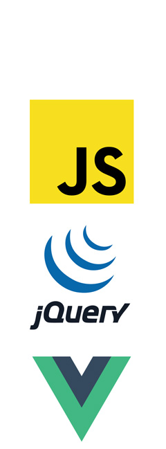
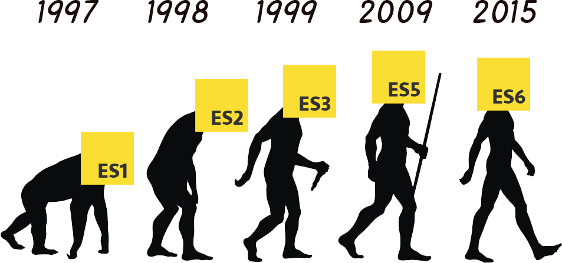

###### WEEK 01

# Pre Survey

수업 시작 전, __사전 조사/레벨 테스트__입니다. 아래 링크 글을 따라가 설문 및 질문에 응답해주세요. 

[How much do you know about JavaScript?](https://goo.gl/forms/ksQlGF767PZmMmEA3)

※ 본 과정은 과정 시작 전, 수강생 수준 테스트 후 평균 학습 능력에 따라 커리큘럼이 변동될 수 있습니다. 
요컨대 수강생 수준이 부족하다 판단될 경우 JavaScript 기본기를 다지는 교육으로 변경 진행합니다.

 
 

# Agenda

#### WEEK 01. JavaScript DAY
첫째 주, JavaScript 언어에 초점을 두고 다양한 이야기를 나눠 봅니다.

#### WEEK 02. jQuery DAY
둘째 주, jQuery 라이브러리 활용 방법에 대해 이야기 나눠 봅니다.

#### WEEK 03. Vue DAY
셋째 주, Vue JS 프레임워크에 대해 이야기 나눠 봅니다.

 
 

## 01 × JavaScript DAY

첫째 주는 JavaScript 언어에 대해 이야기해보는 시간입니다. 
언어적 특성 또는 설계 패턴, ECMAScript 2015 컴파일 등 흥미롭고 다양한 주제를 다뤄봅니다.

1. [JavaScript Core](https://developer.mozilla.org/ko/docs/Web/JavaScript)
1. [JavaScript Anti/Good Pattern](http://bonsaiden.github.io/JavaScript-Garden/)
1. [JavaScript Design Pattern](https://addyosmani.com/resources/essentialjsdesignpatterns/book/)
1. [ECMAScript 2015(ES 6)](http://babeljs.io/learn-es2015/) & [Babel CLI](http://babeljs.io/)

 

 
 

## JavaScript 기초 학습은 여기서<i>!</i>

언어에 대한 기초 지식이 부족한 분들은 공개 강의를 통해 실력을 __UPGRADE__ 해보세요.

글 읽는 것을 싫어하는 분들은 영상 강의가 좋겠죠? 
[JavaScript × opentutorials.org](https://opentutorials.org/course/743)

글 읽는 것을 좋아하는 분들은 여기서 공부해보세요<i>!</i> 
[JavaScript × poiemaweb.com](http://poiemaweb.com/)

